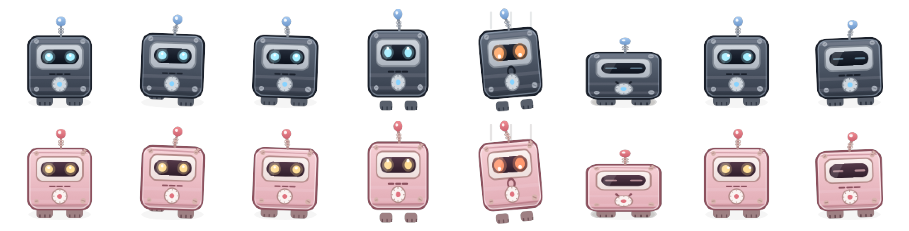

# WindowPet

[](LICENSE) [](https://github.com/jke48222/WindowPet/releases/latest)   

A small robot lives on your desktop and treats your real application windows as ground. It stands
on title bars, rides a window as you drag it, leaps to whatever app you switch to, and falls when
you close the window under its feet. You can reach in and boop it, pick it up, and throw it,
because the transparent layer it lives on is click-through everywhere except the pixels the
creature actually occupies.

It also talks. Option Space opens a chat panel, and the same creature can answer questions, look
at your screen, and run things for you, with every destructive action stopped at a confirmation
first.

Zero third party dependencies. `Package.swift` declares no external packages.



## What problem this solves

Desktop pets are a thirty year old genre and almost all of them share one flaw: the creature lives
on a transparent sheet in front of your screen and knows nothing about what is behind it. It walks
along the bottom of the display or a fixed invisible line, and your windows slide past like
scenery. The illusion collapses the first time you move something.

The version worth building treats the window layout as the level. Your screen is already a
platformer: every window's top edge is a ledge, an overlapping window covers part of that ledge,
and the bottom of the screen is the floor. Read that layout continuously and dragging a window
becomes moving a platform, closing one drops whatever was standing on it, and switching apps gives
the creature somewhere new to jump to.

Two things make that hard on macOS, and they are the two things this project is actually about.

**Permissions.** The obvious way to learn about windows is to ask for their titles and owners, and
that request trips the Screen Recording permission prompt. A pet that demands screen recording
before it will do anything is a pet nobody installs. The window tracking here reads bounds,
stacking order and process ID only, which macOS gives away for free.

**Energy.** A creature that is always on screen is always costing something. Anything that idles at
a few percent of a CPU core is a battery complaint waiting to happen, and "it feels fine" is not a
number. So the cost is measured per phase against a written budget, and the benchmark is in the
repo.

## How it works

```
CGWindowListCopyWindowInfo        WorldModel          Terrain           Planner
bounds, z-order, PID         ->   windows plus   ->   standable   ->    goal oriented route
zero permissions                  screen floors       segments          walk, leap, step off
        ^                                                                     |
        |                                                                     v
AXObserver events (Tier 2)                                              PetEngine
"something moved, go look"                                              state machine
opt-in, carries no geometry                                                   |
                                                                              v
                                                                       OverlayStage
                                                                       one panel per display
                                                                       click-through except
                                                                       over creature pixels
```

### Two tiers, and only one of them is authoritative

**Tier 1 needs no permissions and is the source of truth.** `CGWindowListCopyWindowInfo` hands back
bounds, window layer and process ID for every window on screen. That is enough to build terrain,
and macOS grants it without a prompt. It is polled adaptively: 60 Hz only while the tracked window
is actually moving, 10 Hz once it settles, 4 Hz after twenty seconds of stillness, 2 Hz with
nothing to track. The hot loop asks the window server about one window rather than copying the
entire list. [`Tier1.swift`](Sources/WindowPet/Tier1.swift).

**Tier 2 is optional and buys latency, not authority.** With Accessibility permission granted from
the menu bar (the app never prompts on its own), an `AXObserver` delivers an event the moment a
window moves instead of waiting for the next poll. The accessibility API is the structured
description of windows and controls that macOS publishes for screen readers. The important design
choice: **these events never carry geometry.** They only mean "consult Tier 1 now," so an app whose
accessibility tree lies cannot move the creature. Every element gets a 100 millisecond messaging
timeout, because the default would hang the pet against a beachballing app. Observers are capped
at six with least-recently-used eviction. If Tier 2 fails completely, everything still works.
[`Tier2.swift`](Sources/WindowPet/Tier2.swift),
[`Tier2Policy.swift`](Sources/WindowPetCore/Tier2Policy.swift).

### Terrain, and moving with apparent intent

[`Terrain.swift`](Sources/WindowPetCore/Terrain.swift) takes the window list in stacking order and
splits each top edge into the stretches that are genuinely exposed. A window half covered by
another offers half a ledge.

[`Planner.swift`](Sources/WindowPetCore/Planner.swift) plans a route over that terrain in the style
of GOAP (goal oriented action planning, the technique from game AI where an agent searches over
available actions to reach a goal state rather than following a fixed script). Its actions are
walk, ranged leap and step off. Multi step plans are what read as intent: "walk under that window,
then jump up to it" looks deliberate in a way a random interval scheduler never does.

### The click-through hole

[`OverlayPanel.swift`](Sources/WindowPet/OverlayPanel.swift) is a borderless non-activating panel,
floating above everything, joining all Spaces, ignoring mouse events. It can never steal focus and
never eats a click.

The creature would be untouchable if that were the whole story, so
[`OverlayStage.swift`](Sources/WindowPet/OverlayStage.swift) opens a hole. A global mouse-moved
monitor (which needs no permission) tracks the cursor, and each animation frame carries a coarse
32 by 32 alpha mask, about a kilobyte, recording which pixels are opaque. The panel accepts mouse
events only while the cursor is over solid creature pixels, and the test is facing aware. A quick
click boops it. A drag picks it up and pauses physics entirely. Releasing throws it, using the
cursor's recent velocity from a ring of position samples.

That mask is the difference between a creature that feels physical and a picture painted on your
screen.

### The sprite moves on the GPU

The creature is a Core Animation layer moved inside a transaction, not a window whose geometry the
window server has to recompute. That single change is what brought active CPU inside budget, from
roughly 4 to 5 percent down to about 1.

### The assistant

Option Space (rebindable) opens [`CommandBar.swift`](Sources/WindowPet/CommandBar.swift), the one
surface for every input method: typed, push to talk, or the opt-in "Hey Rusty" wake word. Requests
route through three tiers, cheapest first: a free local grammar, then Apple's on-device foundation
model, then Claude over HTTP.

With Claude, requests run as a real tool-use loop: it calls a tool, reads the actual result, and
picks the next step until the job is done, so a failure becomes an adaptation rather than a false
"done". It can also search and read the web itself (Anthropic-hosted tools, run server-side), see
the screen when you ask, and remember what matters between launches.

**Every tier only ever proposes.** Each returns a verb, an argument and a reply. Execution always
goes through the same gate, and that is the part worth reading.

### What he can actually do

Beyond opening apps and pressing keys, the abilities that exist because he lives on your windows
rather than in a chat box:

- **He can see the windows.** `windows` reports every open window: which apps, how many, what size,
  and where on screen, in words rather than coordinates. It reuses the same zero-permission Tier 1
  poll the creature walks on, and it keeps the invariant below: app names come from the process id,
  never from `kCGWindowOwnerName`, and no window title is read anywhere in it.
- **He can arrange them.** `place_windows` takes "Safari left, Terminal bottom right" and moves them
  through the Accessibility trust he already holds, on whichever display each window is already on.
  `save_layout` and `layout` remember and restore an arrangement by name.
- **He can watch and tell you.** `watch Xcode until the build finishes` returns immediately and says
  something later, when that app's windows have stopped changing or it quits. This is the one thing
  a creature standing on your windows can do that a chat window structurally cannot: he is already
  counting how often each app changes, so a watch costs one comparison per second.
- **He remembers what you copy.** Held in memory only, never written to disk, and filtered twice:
  once by the system, because password managers mark their pasteboard entries concealed, and once by
  [`ClipPolicy`](Sources/WindowPetCore/ClipPolicy.swift), which drops anything shaped like a key or
  a token.
- **You can drop a file on him.** With an Anthropic key, text and PDFs are read into the
  conversation; anything else is named honestly rather than pretended at. Without a key he says
  that reading files needs the Claude brain and reads nothing.
- **He speaks MCP.** Servers declared in `mcp.json` join the same schema and the same confirmation
  gate as the built-in verbs, so abilities stop being a list somebody has to recompile. A server
  runs only after you approve its exact command line once; an entry that is added or edited later
  asks again. Servers start without inheriting your API keys or the app's privacy permissions, and
  the sample file the menu writes starts nothing until you move an entry into `servers`.
- **He can put the windows back.** An arrangement records where every window was first, at the size
  it actually was, so "put it back" returns a deliberately odd window to its odd size rather than
  tidying it into a half. Session-scoped on purpose: a frame from three days ago is stale, and
  saying "nothing to undo" beats restoring a window to where it used to live.
- **Dictation, with no model in the loop.** Hold Option-D and speak, and the words go from the
  on-device recognizer straight into whatever app is in front. Nothing is sent anywhere and nothing
  is spent. [`DictationPolicy`](Sources/WindowPetCore/DictationPolicy.swift) handles spoken
  punctuation, including the part that is actually hard: "that period piece" is a length of time and
  "world period" ends a sentence, so a determiner in front vetoes the substitution.
- **Standing asks.** "Every weekday at 9: tell me what is on my calendar." He is already running all
  day, so this needs no daemon and no server. A missed slot is not replayed: a laptop waking at 3pm
  does not get every morning it slept through.
- **He can learn a trick.** Record what he does, name it, ask for it later. What gets recorded is
  what *Rusty* did, never your keystrokes, which is a deliberate limit: recording a person's typing
  would need input monitoring, a permission this app has spent its whole design avoiding. Replay
  goes back through the same gate, so a step that confirmed when it was recorded confirms again, and
  `run_admin` is never recordable at all.
- **He knows when to keep quiet.** Everything he says unprompted goes through
  [`QuietPolicy`](Sources/WindowPetCore/QuietPolicy.swift) first. Focus on, microphone in use by
  another app, or the screen locked, and the message is held rather than lost, then delivered with a
  word about why it waited. Full screen or mid-sentence, and it appears in the panel without being
  spoken. Anything older than two hours is dropped: a build that finished at lunchtime is not news.
- **Memory can belong to one app.** "In Xcode: keep the left half" only comes back while Xcode is in
  front. Facts about the person stay global.

## The safety gate

[`Assistant.swift`](Sources/WindowPetCore/Assistant.swift) defines the action verbs and marks which
ones require confirmation:

- `quitApp` always confirms.
- `runAppleScript` runs straight through only for a short allow-list of shapes (volume,
  notifications, dark mode, Music and Spotify playback), checked by
  [`AppleScriptPolicy.swift`](Sources/WindowPetCore/AppleScriptPolicy.swift). Every other script
  confirms. An allow-list rather than a list of dangerous commands, because AppleScript has too
  many ways to reach a shell for a deny-list to catch them all.
- `runAdminShell` always confirms, without exception.
- `readFile` always confirms. A model that can be talked into reading an arbitrary path is a model
  that can be talked into reading a key file, so the tool form stops for a human every time. A file
  **dropped onto Rusty** does not use this tool at all: the drop is the consent, and the contents go
  straight into the conversation with the panel showing what was read.
- An **MCP tool confirms unless its server is marked `"trust": "always"`** in `mcp.json`. Trust is a
  line a person writes in a config file, never a decision the model can take for itself.
- A **standing ask always confirms**, because it runs the whole agent later with nobody watching.
- **Outside content raises the bar for the rest of a run.** Web pages, files, MCP results, the
  screen, the clipboard history and anything the wake word heard can all carry words you never wrote
  or said. Once one of them is in the conversation, the model may follow those words. "Hey Rusty"
  hears any audio nearby, a video or a call included, so a request it hears counts as outside
  content from the start. From then on, typing, key presses, copying, opening links or apps,
  shortcuts, scripts, tricks and searches also confirm, and Rusty can no longer change what he
  remembers.

The safety row shows the full text that will run, with line breaks and invisible characters spelled
out. Anything too long to show in full (over 2,000 characters) is refused rather than shown cut off.
A check waits for a Return typed into the panel, and keystrokes Rusty posts himself are marked and
dropped. A check raised while you were typing somewhere else asks you to click the panel first, and
one left for two minutes expires instead of being approved.

Four properties make this hold up:

1. **The agent loop routes through the same gate as typed input.**
   [`AgentSession.swift`](Sources/WindowPet/AgentSession.swift) checks `needsConfirmation` on every
   tool call the model makes. When one needs approval, the loop **suspends mid-plan**, stashing the
   remaining calls, rather than pre-approving a batch. Each destructive step gets its own
   checkpoint.
2. **Privileged commands hand off to macOS.**
   [`AssistantExecutor.swift`](Sources/WindowPet/AssistantExecutor.swift) runs them via
   `do shell script ... with administrator privileges`, which puts the system's own password dialog
   in front of the user. There is no stored credential and no standing privileged helper. A
   privileged command therefore needs two human checkpoints: the panel confirmation, then the OS
   password prompt.
3. **It is tested.** 26 tests on the routing layer and 19 on the agent loop, including replays of
   whole multi-turn conversations from canned API responses. Further tests feed the script gate the
   shell escapes it has to catch. End to end checks in the rig assert that quit, admin and
   destructive scripts are gated while a harmless script is not, and that an untrusted MCP tool and
   a `read_file` on an arbitrary path both stop for a human.
4. **There is a spending ceiling.** [`BudgetPolicy.swift`](Sources/WindowPetCore/BudgetPolicy.swift)
   is checked before every model call, including each iteration of the loop, so a plan that keeps
   deciding on one more step stops at the ceiling rather than past it. It defaults to $5 a day and
   is set under Daily Spend Limit in the menu bar.

## What it never reads, stated precisely

**The window tracking layer never reads window titles.** `kCGWindowName` and `kCGWindowOwnerName`
trip the Screen Recording prompt on recent macOS, and bounds, layer, process ID and window number
do not. The invariant is written into [`Tier1.swift`](Sources/WindowPet/Tier1.swift) lines 18 to 19
as a comment and is deliberately greppable, and it holds: those two constants appear nowhere else
in the source.

The reaction system, which notices that a Terminal is retitling itself constantly during a build,
senses **frequency only**. It subscribes to `kAXTitleChangedNotification` and counts events. The
comment on that line in [`Tier2.swift`](Sources/WindowPet/Tier2.swift) reads "frequency only, we
never read the title," and the string genuinely never reaches the app.

**This claim is about window tracking, and only window tracking.** The shipped app also has a "look
at my screen" feature: [`ScreenCapture.swift`](Sources/WindowPet/ScreenCapture.swift) takes a
screenshot and [`ClaudeVision.swift`](Sources/WindowPetCore/ClaudeVision.swift) sends it with your
question. That needs Screen Recording permission and macOS will prompt for it the first time you
use it. Both statements are true at once, and stating only the first would be misleading the moment
somebody launched the app.

## What leaves the Mac

- **Claude.** With an Anthropic key set, Rusty sends Anthropic your request, the recent
  conversation, remembered facts, a short summary of your windows, and, when a request uses them, a
  screenshot of the screen, file contents and clipboard text. Without a key nothing is sent, and the
  local grammar and Apple's on-device model still answer.
- **Spoken replies** use the on-device macOS voice by default. The optional Microsoft voice
  (edge-tts) and ElevenLabs send the reply text to those services. Choosing the Microsoft voice
  asks first, and the ElevenLabs key dialog says what is sent.
- **"Hey Rusty" is off until you turn it on.** It keeps the microphone open while on, and it only
  runs on Macs that can recognize speech on the device, so that audio never goes to a server.
  Dictation has the same rule. Push to talk also stays on the device when it can; on a Mac without
  the English on-device model it falls back to Apple's speech service, which is why the wake word's
  refusal note says push to talk still works.
- **API keys live in the login Keychain**, never in a preferences file. A key saved by an older
  version is moved there at launch.

## Results

Every number below has a file or a command behind it.

| Result | Value | How it was measured |
| --- | --- | --- |
| Unit tests | **443 passing, 0 failures**, across 27 files | `swift test`, run 2026-09-29 |
| End to end rig | **138 of 138**, seven parts | `--testrig`, run 2026-08-27, caveat below |
| Idle CPU | **0.24%** of one core, 47.7 MB | [`ENERGY.md`](ENERGY.md), M5 Pro, release build |
| Perched CPU | **0.42%**, 47.6 MB | Same run |
| Active CPU | **1.04%**, 48.5 MB | Same run |
| Source size | 25,591 lines, 117 files | Sources 19,278, Tests 4,480, Tools 1,793, Package.swift 40 |
| Dependencies | zero | `Package.swift` |

### The energy numbers, and how they were taken

[`ENERGY.md`](ENERGY.md) is generated by [`Tools/energy-bench.sh`](Tools/energy-bench.sh), not
typed by hand. The method matters more than the figures:

- Measured 2026-08-19 on an Apple M5 Pro, macOS 27, **release build**.
- The app instruments itself. `--bench` drives three **deterministic 15 second phases** through the
  same debug hooks the test rig uses, so "sleep," "perched" and "active" mean the same thing on
  every run, rather than being whatever the process happened to be doing during a sample window.
- CPU comes from `getrusage`, summing user and system time over the phase. Resident memory comes
  from `task_info`.
- Budgets are encoded in the script and it **exits non-zero on any hard budget violation**, so it
  can gate a build.
- Reproduce: `bash Tools/energy-bench.sh 15`. Cross-check from outside the process:
  `sudo powermetrics --samplers tasks -i 5000 -n 3 | grep WindowPet`.

| Phase | What it is doing | CPU | Budget | Resident |
| --- | --- | ---: | ---: | ---: |
| sleep | asleep, nothing moving | **0.24%** | 0.3% hard | 47.7 MB |
| perched | awake on a title bar, breathing and blinking | 0.42% | 1.0% soft | 47.6 MB |
| active | continuous planned travel between two windows | **1.04%** | 3.0% hard | 48.5 MB |

### The measurement that is not published

The same file records an attempt to measure the wake word listener. It came back **inconclusive,
so it is not published.** Sampling the installed app with the setting on and off gave
overlapping CPU, roughly 0.7 to 2.1 percent either way, with noise dominating at that sample size.

Then the reason turned up. Running the installed binary with `--diag` reported that speech and
microphone permission had never been asked for, which means speech recognition never started, which
means **nothing was measured at all.** A real number needs Microphone and Speech Recognition
granted to the installed app first.

The figures in the table above are therefore the wake-word-off configuration, and the wake-word-on
cost is currently unknown.

### The leap solver test

A ballistic solver answers this question: given where the creature is standing and where it wants
to land, what launch velocity produces a gravity-driven arc that ends exactly on the target?
[`PetPhysics.swift`](Sources/WindowPetCore/PetPhysics.swift) returns a horizontal velocity, a
vertical velocity and a duration.

The interesting part is how it is tested.
[`PhysicsTests.swift`](Tests/WindowPetCoreTests/PhysicsTests.swift) `testLeapSolutionLandsOnTarget`
does **not** re-derive the closed form and check the algebra against itself. It takes the solver's
answer and **numerically integrates the arc forward using `PetPhysics.fallStep`, the exact function
the running engine steps every frame**, at a 1/120 second timestep with the final partial step
clamped. Across three targets (up and right, down and left, and level) the creature must arrive
within 1.5 points on both axes.

That is a stronger test because it closes the loop between the two pieces that have to agree. A
closed form check only proves the formula is self consistent. This proves the solver and the engine
share a sign convention (this codebase uses AppKit's y-up, so gravity subtracts from vertical
velocity), share a gravity constant, agree about the duration clamp, and survive the discretization
error of the real frame cadence. Any of those drifting apart is a creature that visibly overshoots,
and none of them would be caught by checking the maths.

### About the rig number

`--testrig` is not a unit test suite. It launches the real app, opens and animates its own windows,
and spawns helper processes that wiggle a titled window from another process so the accessibility
observer sees genuine cross-process events, then asserts against the running creature.

The total is a **runtime tally**, not something a static count of the source can settle: the rig
increments once per named step that resolves plus each explicit check. Runs on 2026-08-27 gave
138 of 138 repeatedly, with a 90, an 87 and an 86 recorded while the machine was loaded (a background
sync process pinning a core, then a load average above 5 with the window server at 18%). The failing
checks are always window choreography timing out, and the sets differ run to run rather than
repeating, which is the signature of load rather than a regression.

Concretely, on the development machine: a normal working session (a browser and a chat app open)
sits at a load average around 5 and never falls below 2, and at that load the rig passes about two
runs in three. It passes consistently when nothing else is compiling. **A failure here is not
evidence of a regression until it repeats three times.** `Tools/release.sh` encodes exactly that:
it retries the rig up to three times and requires one clean pass, because what is flaky is the
failure, never the pass. The same caveat applies to the energy benchmark, which reported a
hard-budget failure under load and passed with the identical build ninety seconds later. **Treat a
full pass as the expected result and planner travel as the part that is timing sensitive under
load.** The rig is built to wait rather than assert against wall
clock choreography, but that phase has the least slack.

The seven parts: window terrain, floor and touch and climb, Tier 2 accessibility events, the
behavior planner, reactions, third party sprite pack import, and the assistant surface. The last
runs entirely offline against real objects, with no API calls.

Four assistant checks were added after the 2026-08-27 runs, so the next full pass should read 142
of 142. They check that the tool-server sample starts nothing, the dictation shortcut is wired, the
speech safety net outlasts the longest reply, and the wake word stays off until switched on. The
rig has not been rerun since they were added.

## Running it

Requires macOS 14 or newer and the Swift toolchain from Xcode. The released app is universal, so
it runs on Apple silicon and Intel Macs. There is no package
manager step, because there are no dependencies.

```bash
swift run -c release WindowPet
```

The creature drops onto your frontmost window. Quit from the paw print in the menu bar, which also
shows which app it is currently riding, or `pkill -x WindowPet`.

Grant Accessibility from that same menu when you want event-driven tracking. The app never prompts
for it on its own, and everything works without it.

```bash
swift test                          # 443 unit tests, headless, opens no windows
swift run WindowPet -- --diag 6     # verbose tracking log for 6 seconds, then exits
swift run WindowPet -- --testrig    # end to end check, opens its own windows, exits 0 or 1
swift run WindowPet -- --bench 15   # energy benchmark, asserts budgets, exits 0 or 1
swift run WindowPet -- --ask "..."  # headless: run one prompt through the agent and print
```

A successful `swift test` ends with `Executed 443 tests, with 0 failures`. A successful rig run ends
with `RIG PASS <n>/<n>` (138 at the last full run, 142 with the checks added since) and exit code 0.
GitHub Actions runs `swift build -c release` and `swift test` on every push and pull request to
`main` ([`ci.yml`](.github/workflows/ci.yml)); the rig drives real windows, so it stays a local step.

Build a distributable app:

```bash
bash Tools/make-app.sh    # -> build/WindowPet.app
bash Tools/make-dist.sh   # -> build/WindowPet.dmg, drag to Applications
```

Regenerate Rusty's frames. PetGen takes an output directory and writes one PNG per skin and
frame, named `pet_<skin>_<anim>_<n>.png` (for example `pet_sakura_walk_3.png`). It covers the
`tinplate`, `seafoam`, `midnight` and `sakura` skins and the `idle`, `blink`, `look`, `fidget`,
`walk`, `jump`, `fall`, `land` and `sleep` animations. It also writes `pet.png`, a preview of the
first idle frame that the app does not load:

```bash
swift run PetGen Sources/WindowPet/Resources
```

To use commissioned art instead, replace a skin's `pet_<skin>_<anim>_<n>.png` files with images of
the same names and rebuild. If any frame of an animation is missing, that animation shows a plain
placeholder instead of crashing.

The assistant needs an Anthropic API key to reach the Claude tier. Set it from the menu bar; it is
stored in your login Keychain. Without one, the local grammar and the on-device model still work.

## Project layout

```
Sources/
├── WindowPetCore/          Pure logic. No AppKit, headless testable, all of it under test
│   ├── Geometry.swift          The Core Graphics to AppKit coordinate flip
│   ├── Terrain.swift           Window list to standable segments, occlusion aware
│   ├── PetPhysics.swift        Gravity, fall integration, the ballistic leap solver
│   ├── Planner.swift           Goal oriented route planning over the platform graph
│   ├── Behavior.swift          Seeded random source and the needs vector driving choices
│   ├── RatePolicy.swift        Adaptive poll cadence driven by observed motion
│   ├── ReactionPolicy.swift    Exponentially decaying event-rate maths
│   ├── Tier2Policy.swift       Accessibility health: probation, contradiction, degradation
│   ├── Assistant.swift         The action verbs, and which ones require confirmation
│   ├── AppleScriptPolicy.swift The short list of scripts that may run without a Return
│   ├── ClaudeRouting.swift     Request build and response parse for the Messages API
│   ├── ClaudeAgent.swift       The tool-use loop and its tool schemas
│   ├── AgentLoop.swift         When to stop, resend or execute, plus the message array
│   ├── StreamAccumulator.swift Rebuilding a turn from a server-sent event stream
│   ├── PetMemory.swift         Durable facts and a conversation tail across launches
│   ├── ShimejiActions.swift    Parsing third party sprite pack definitions
│   ├── BudgetPolicy.swift      The daily spend ceiling, checked before every call
│   ├── WindowReport.swift      Describing the open windows in words, no titles
│   ├── WindowLayout.swift      Slots, placements, and the arrangement grammar
│   ├── WatchPolicy.swift       When a watched app counts as finished
│   ├── ClipPolicy.swift        What the clipboard history keeps, and never keeps
│   ├── FilePolicy.swift        What Rusty will read off disk, and how much
│   ├── MCPProtocol.swift       Model Context Protocol client framing
│   ├── PetHelp.swift           What he can do, in one place the menu reads from
│   ├── DictationPolicy.swift   Spoken punctuation and casing, no model involved
│   ├── SchedulePolicy.swift    Reading "every weekday at 9" and deciding when
│   ├── QuietPolicy.swift       When not to speak, and what to do with it instead
│   ├── Trick.swift             Learned routines and what may be recorded
│   ├── ArrangementHistory.swift  Where windows were, so they can go back
│   ├── DisplayGeometry.swift   Floors, ceilings and walls across several displays
│   ├── ScreenLockState.swift   Awake and past the lock screen: when listening may resume
│   └── SkinDefinition.swift    The user-authored JSON skin schema
├── WindowPet/              The AppKit application
│   ├── Tier1.swift             Window list polling. Zero permissions
│   ├── Tier2.swift             AXObserver event stream. Opt-in
│   ├── WorldModel.swift        Windows and screen floors to platforms
│   ├── PetEngine.swift         The creature state machine, the largest file here
│   ├── PetEngine+Behavior.swift  Turning a brain decision into a plan of steps
│   ├── PetEngine+Reactions.swift Reactions, each derived from observable state
│   ├── PetEngine+Mouse.swift     The click-through hole, grabbing and flinging
│   ├── PetEngine+Debug.swift     The read-only surface the rig and --diag drive
│   ├── Screens.swift           Which display a panel or a snapped window belongs on
│   ├── WindowInventory.swift   The window list and the arranger that moves them
│   ├── WatchRegistry.swift     Live watches, ticking between turns
│   ├── ClipboardHistory.swift  In-memory clipboard recall, never written to disk
│   ├── LayoutStore.swift       Named arrangements on disk
│   ├── FileReader.swift        Text and PDF reading for drops and read_file
│   ├── MCPHost.swift           Spawning MCP servers and speaking JSON-RPC to them
│   ├── Dictation.swift         Hold a key, speak into the app in front
│   ├── QuietHours.swift        Reading Focus and the microphone, holding announcements
│   ├── ScheduleRunner.swift    Standing asks, and the trick store beside them
│   ├── OverlayStage.swift      Presentation, and the click-through hole
│   ├── OverlayPanel.swift      The transparent non-activating all-Spaces panel
│   ├── SpriteSet.swift         Animation frames and their per-frame alpha masks
│   ├── CommandBar.swift        The chat panel: typed, spoken and wake word
│   ├── AgentSession.swift      One agentic conversation, suspending on confirmation
│   ├── AssistantExecutor.swift Executing gated actions, including the admin handoff
│   ├── AssistantBrain.swift    On-device Apple foundation model routing
│   ├── ClaudeRouter.swift      The cloud tier
│   ├── VoiceInput.swift        Push to talk, on-device recognition when available
│   ├── WakeWordListener.swift  Opt-in always-on wake word, one audio engine
│   ├── ScreenCapture.swift     Screen grab for "look at my screen"
│   ├── Skins.swift             Four built-in finishes
│   ├── ShimejiImporter.swift   Third party sprite packs, hot swappable
│   ├── TestRig.swift           The --testrig runner, seven parts
│   ├── Bench.swift             The --bench self-instrumenting energy benchmark
│   └── App.swift               Delegate, mode parsing, status item
└── PetGen/                 One-shot sprite generator

Tests/WindowPetCoreTests/   443 tests, all against the pure core
Tools/                      Character design sheets, app and DMG packaging, energy benchmark
ENERGY.md                   Generated by Tools/energy-bench.sh
```

`swift test` covers `WindowPetCore` only. There is no unit test target for the app itself, which is
exactly why `--testrig` exists.

## The character

Rusty, a mid-century tin toy robot: teal body, silver faceplate, cyan LED eyes that go alarm-orange
while falling and dim to slits when blinking, a chest dial, rivets, and an antenna bobble that sways
with the walk. Four alternative finishes ship with the app, and skins can be authored as plain JSON.

With Reduce motion turned on (System Settings > Accessibility > Display), Rusty stops wandering,
travelling between windows, climbing and hopping on his own. He still rides a window you drag,
falls when one closes, and moves aside for full-screen video, and greetings and celebrations become
an in-place squash.

Art is a build input rather than runtime drawing.
[`Tools/chargen.swift`](Tools/chargen.swift) holds ten candidate designs. Any shimeji-ee sprite
pack can be imported and hot swapped while the creature is running: their art, this engine.

## Status

[v1.2.0](https://github.com/jke48222/WindowPet/releases/tag/v1.2.0) is a universal app bundle in a
drag-to-Applications DMG (3.5 MB) that anyone can download and open without a Gatekeeper warning.
It is signed with `Developer ID Application: Jalen Edusei (PK389W6V96)`, notarized by Apple, and
stapled. The published DMG was downloaded and checked the way a stranger's Mac would:

```
WindowPet.dmg: accepted
source=Notarized Developer ID
```

`bash Tools/release.sh <version>` is the whole thing in one command. It refuses to build or publish
until every gate passes. The version must match the tag, release notes must exist, the tree must be
clean and the tag free. Unit tests and the end to end rig must pass on the binary that will
actually ship, and a Developer ID certificate and stored notary credentials must exist. `--publish` then notarizes,
staples, tags, and publishes the GitHub release with the changelog section for that version.

How it got here:

- **Hardened runtime is on**, on every signing branch rather than only the Developer ID one, so
  what runs daily is what notarization will accept. It needs entitlements as well as TCC grants:
  [`Tools/WindowPet.entitlements`](Tools/WindowPet.entitlements) declares
  `device.audio-input` for the microphone and `automation.apple-events` for the AppleScript
  tool. Without them the microphone is denied with no prompt and no error, which is the kind of
  failure that is worst to discover at submission time.
- **The build is universal**, arm64 and x86_64, both slices stamped at the macOS 14 minimum.
- **The DMG is signed** when a Developer ID identity is present, and says plainly that it is not
  when one is absent.
- **`v1.2.0` is tagged in git** and matches the Info.plist, with release notes in
  [`CHANGELOG.md`](CHANGELOG.md).

**Other known gaps:**

- **The wake word's energy cost is unmeasured**, for the reason given above. Granting the installed
  app Microphone and Speech Recognition permission and re-running the benchmark is the fix.
- **Dictation is untested end to end**, for the same reason: it uses the same recognizer, and
  `--diag` still reports `speech not asked yet, mic not asked yet`. The text handling is covered by
  unit tests and the shortcut registers (`--diag` reports it), but nobody has spoken into it yet.
- **The Focus reader is untested against a Focus mode that is actually on.** macOS has no public API
  for it, so [`QuietHours`](Sources/WindowPet/QuietHours.swift) reads the database macOS keeps for
  its own use. It treats any failure as "not in Focus", because a watch that never fires is worse
  than one that speaks during a Focus mode. `--diag` reports what it currently reads.
- **The wake word note now survives a bench run.** It lives in
  [`Tools/energy-notes.md`](Tools/energy-notes.md) and `energy-bench.sh` appends it below the
  generated block, rather than sitting inside `ENERGY.md` where every run destroyed it.
- **The planner travel phase of the rig is timing sensitive** under load, as described above.
- **No screen recording or demo clip exists**, which for a project whose entire pitch is visual is
  the single most valuable missing asset.
- **Multi-display behavior is tested as policy, not on hardware.** The 19 tests in
  [`DisplayChoiceTests.swift`](Tests/WindowPetCoreTests/DisplayChoiceTests.swift) cover the rules
  for picking a display and clamping to it. The 15 in
  [`DisplayGeometryTests.swift`](Tests/WindowPetCoreTests/DisplayGeometryTests.swift) cover floors,
  ceilings and walls with displays side by side and stacked. Every run so far has been on one
  screen.

## License

MIT. See [LICENSE](LICENSE).

---

Jalen Edusei, [jalenedusei.com](https://www.jalenedusei.com),
[github.com/jke48222](https://github.com/jke48222)
